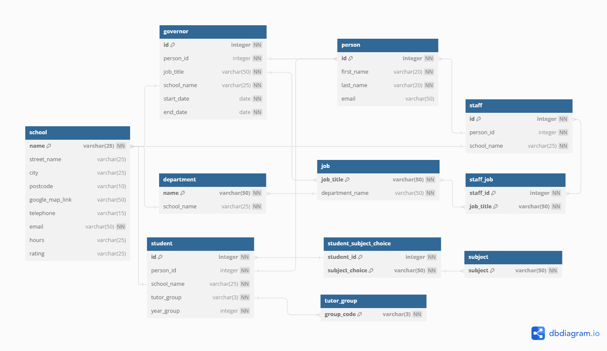

# Computer Science Projects - Portfolio Project: Creating A Database

This portfolio project was created as part of [Codecademy's](https://www.codecademy.com) Computer Science Career Path course.

## Table of contents

- [Project Overview](#project-overview)
  - [Project objectives](#project-objectives)
- [Database: Greenwood High School](#database-greenwood-high-school)
  - [Database design](#database-design)
  - [Database schema](#database-schema)
  - [Database data](#database-data)
  - [Database roles](#database-roles)
  - [Database indexes and constraints](#database-indexes-and-constraints)
- [Process](#process)
  - [What I learned](#what-i-learned)
  - [Potential improvements to database](#potential-improvements-to-database)
  - [Useful resources](#useful-resources)
- [Author](#author)

## Project Overview

"Welcome to the portfolio project for CS103: Databases. In this project, you will create a database on your own computer that contains all of the elements that we’ve covered in this course.

If you have worked on other Off-Platform Projects over the course of CS103 (specifically the “Designing A Database From Scratch” project), you will likely already have a database with some of the foundational elements already set up. In that case, feel free to use that database as a starting point to get a bit of a head start." - [Codecademy](https://www.codecademy.com)

### Project objectives

- Research the topic of your choosing to create a entity relationship diagram for your database.
- Create the schema of the database using PostgreSQL.
- Populate your database with some data.
- Update your database to ensure your data stays intact. This could include adding constraints and roles.
- Update your database to ensure your database stays fast. This could include adding indexes, normalising your database, and actively monitoring and maintaining your database.

## Database: Greenwood High School

For this particular project I decided to extend the [“Designing A Database From Scratch” project](https://github.com/VTickner/codecademy-computer-science?tab=readme-ov-file#designing-a-database-from-scratch) which had some of the foundational parts already completed for this project.

### Database design

The database is based around a hypothetical UK secondary school. I focused the database around people who would be closely associated with the school and how they are linked together to decide on what information to add and how to organise it. I designed the following schema for the database, some modifications were made from the original design that I had (I've included the [DBML database markup language file](./school.dbml)):



### Database schema

The database schema was implemented using Postbird (which is an open source PostgreSQL GUI client).

- SQL File URL: [School Schema Tables](./school_schema_tables.sql)

### Database data

I got ChatGPT to generate hypothetical data based of the schema:


While using ChatGPT helped speed up the generation of data, it didn't keep the data consistent to what it was supposed to add for each individual. For instance, it added a staff member with a note to state they were an art teacher, but never added art teacher as a job. So there were some inconsistencies when trying to add the data that I needed to clear up when inserting data into the table.

- SQL File URL: [School Data](./school_data.sql)

### Database roles

I added several roles to group different access capabilities. Thereby limiting data to the various different groups of people as appropriate when accessing the database. Various test queries were run to check role permissions were set up correctly for accessing only the information expected for the assigned role.

- admin_su (admin super user role):
  - Can access and change anything in the database
  - Assigned to Headteacher and Deputy Headteacher
- student_role:
  - Can select their own data
  - Can select staff name, job title and department
  - Assigned to all students
- governor_role:
  - Can select their own data
  - Can select staff name, job title and department
  - Can select governor's start and end date
  - Assigned to all governors
- staff_role:
  - Can select their own data
  - Can select staff name, job title and department
  - Can view student subject choices

N.B. I only assigned some of the people in the data to the various roles, for testing the role permissions, notes have been left in the file where to create and grant appropriate roles to all users.

- SQL File URL: [School Roles](./school_roles.sql)

### Database indexes and constraints

I also added indexes for the person table to help speed up searches on the database. Indexes were created on the columns first_name, last_name and a combined column index for (last_name, first_name). As the majority of the searches in the database will involve searching and looking up a person's name along with associated data about them.

The governor table was altered to add a constraint onto the `end_date` so that it would always be later than the current date.

- SQL File URL: [School Indexes](./school_indexes.sql)

## Process

- Think of an idea to base the database around - what topic will it be focused on.
- Project brainstorming on what data will be needed, what type of data it is and how to split that up into relevant tables.
- Create the schema for the database.
- Set up a GitHub repository.
- Set up Git version control.
- Write SQL queries to create the tables in the database.
- Use ChatGPT to help create data to populate the database.
- Add roles and grant roles to users.
  - Test out the role permissions.
- Add indexes.
  - Test indexes.
- Add constraints.
  - Test constraints.
- Create blog post about project. (This README file is my post about the project I have created.)

### What I learned

- I had some issues with setting of access to users. When I tried to test the james_smith role, it had issues with selecting from certain tables. Upon checking, I found that the `admin_su` role had been assigned to both users but they hadn't been granted `SUPERUSER` access with it, so altered users to have superuser access.

  ```sql
  CREATE ROLE admin_su WITH SUPERUSER;

  CREATE USER james_smith WITH SUPERUSER LOGIN PASSWORD 'j.smith_password';
  CREATE USER elizabeth_taylor WITH SUPERUSER LOGIN PASSWORD 'e.taylor_password';

  GRANT admin_su TO james_smith;
  GRANT admin_su TO elizabeth_taylor;
  ```

- The most difficult part I had in this project was to make all of the role permissions work correctly. As I was restricting access to tables, and in some cases only allowing parts of tables to be accessed as well by different roles. This led me to learn about various ways to constrain with the use of policies e.g.:

  ```sql
  CREATE POLICY student_person_policy ON person FOR SELECT
    USING (LOWER(first_name) || '_' || LOWER(last_name) = CURRENT_USER);

  CREATE POLICY student_staff_policy ON person FOR SELECT
    USING (EXISTS(SELECT 1 FROM staff WHERE staff.person_id = person.id));

  CREATE POLICY staff_person_select_policy ON person FOR SELECT
    USING (pg_has_role(current_user, 'staff_role', 'member'));
  ```

- I learnt how to concatenate results into a string. I did a test query where it showed all subjects for students in years 10 and 11, in a single table cell so that the information about a particular student was all on one row.

  ```sql
  string_agg(sub.subject, ' -- ') AS subjects
  ```

### Potential improvements to database

- Complete creating all users and granting them appropriate role permissions for all the people in the database.

### Useful resources

- [dbdiagram.io](https://dbdiagram.io/home)
- [chatgpt](https://chatgpt.com/)

## Author

- V. Tickner
