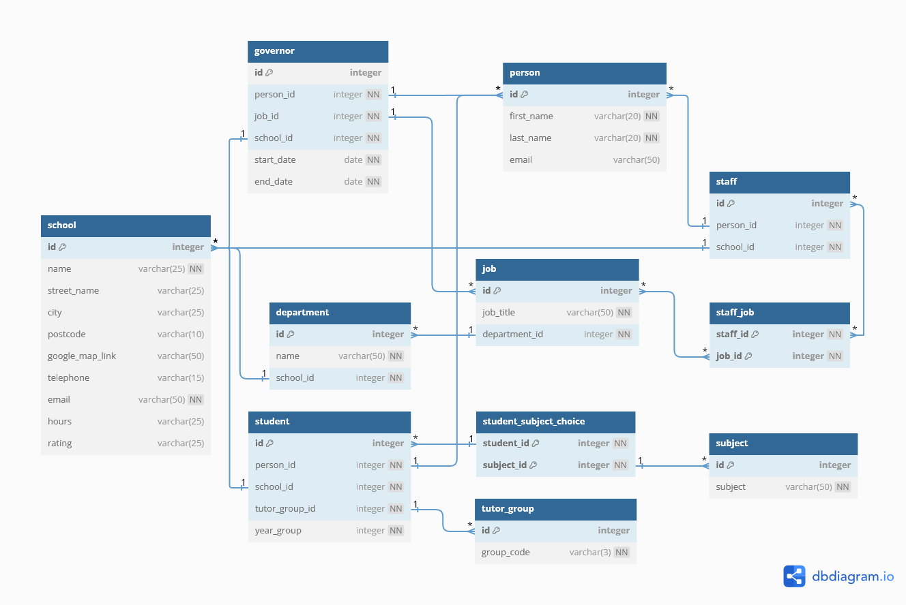

# Computer Science Projects - Portfolio Project: Creating A Database

This portfolio project was created as part of [Codecademy's](https://www.codecademy.com) Computer Science Career Path course.

## Table of contents

- [Project Overview](#project-overview)
  - [Project objectives](#project-objectives)
- [Database: Greenwood High School](#database-greenwood-high-school)
  - [Database design](#database-design)
  - [Database schema](#database-schema)
  - [Database data](#database-data)
  - [Database modifications]()
- [Process](#process)
  - [Database decisions](#database-decisions)
  - [What I learned](#what-i-learned)
  - [Potential improvements to database](#potential-improvements-to-database)
  - [Useful resources](#useful-resources)
- [Author](#author)

## Project Overview

"Welcome to the portfolio project for CS103: Databases. In this project, you will create a database on your own computer that contains all of the elements that we’ve covered in this course.

If you have worked on other Off-Platform Projects over the course of CS103 (specifically the “Designing A Database From Scratch” project), you will likely already have a database with some of the foundational elements already set up. In that case, feel free to use that database as a starting point to get a bit of a head start." - [Codecademy](https://www.codecademy.com)

### Project objectives

- Research the topic of your choosing to create a entity relationship diagram for your database.
- Create the schema of the database using PostgreSQL.
- Populate your database with some data.
- Update your database to ensure your data stays intact. This could include adding constraints and roles.
- Update your database to ensure your database stays fast. This could include adding indexes, normalising your database, and actively monitoring and maintaining your database.

## Database: Greenwood High School

For this particular project I decided to extend the [“Designing A Database From Scratch” project](https://github.com/VTickner/codecademy-computer-science?tab=readme-ov-file#designing-a-database-from-scratch) which had some of the foundational parts already completed for this project.

### Database design

The database is based around a hypothetical UK secondary school. I focused the database around people who would be closely associated with the school and how they are linked together to decide on what information to add and how to organise it. I designed the following schema for the database (I've included the [DBML database markup language file](./school.dbml)):

### Database schema

The database schema was implemented using Postbird (which is an open source PostgreSQL GUI client).

- SQL File URL: [School Schema Tables](./school_schema_tables.sql)

### Database data

I got ChatGPT to generate hypothetical data based of the schema:

While using ChatGPT helped speed up the generation of data, it didn't keep the data consistent to what it was supposed to add for each individual. For instance, it added a staff member with a note to state they were an art teacher, but never added art teacher as a job. So there were some inconsistencies when trying to add the data that I needed to clear up when inserting data into the table.

- SQL File URL: [School Data](./school_data.sql)

### Database modifications

## Process

### Database decisions

Originally I had most of the tables have id integers as primary keys, but I found that was extremely confusing when trying to add data, and double-checking what was in the table content (when viewing the database information). So I re-started the schema and database creation to simplify it and make the information more easily readable and understandable.

### What I learned

### Potential improvements to database

### Useful resources

- [dbdiagram.io](https://dbdiagram.io/home)

## Author

- V. Tickner
